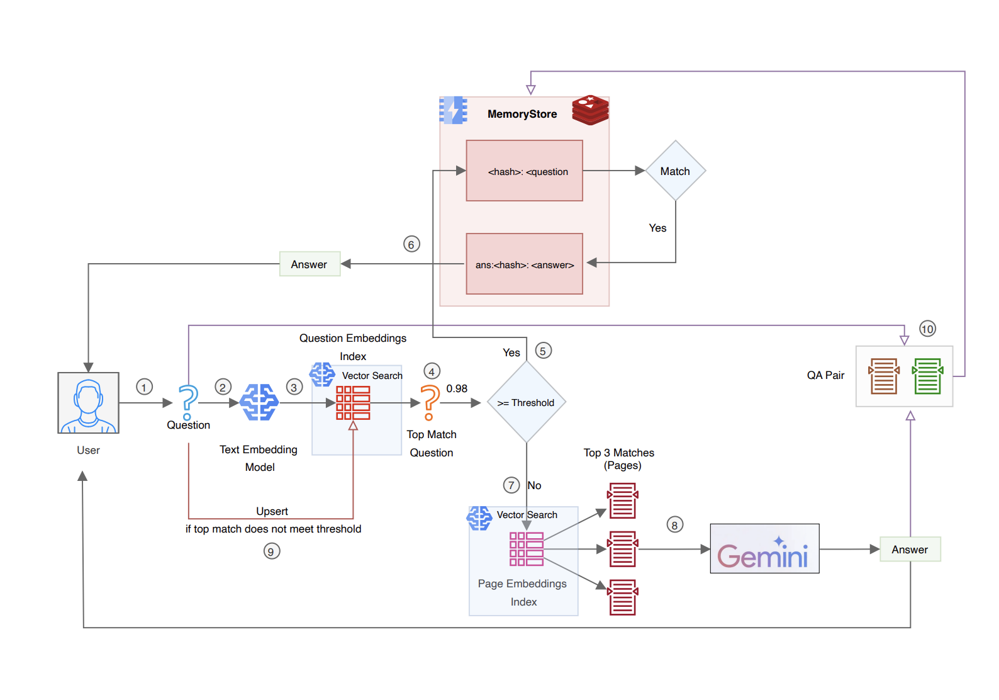

# A Guide to Semantic Caching: Optimizing GenAI Workflows on GCP

This repository focuses on enhancing data retrieval and processing efficiencies in generative AI applications. It achieves this by implementing a semantic caching layer utilizing MemoryStore, Vertex AI Vector Search, and Gemini, primarily on the Google Cloud Platform stack.

This codebase aligns with a Medium article, "[Implementing Semantic Caching: A Step-by-Step Guide to Faster, Cost-Effective GenAI Workflows](https://medium.com/google-cloud/implementing-semantic-caching-a-step-by-step-guide-to-faster-cost-effective-genai-workflows-ef85d8e72883)." This article provides a comprehensive guide on setting up the necessary architecture for semantic caching in a document question-answering RAG pipeline.

For detailed instructions and more insight, please refer to the article.


## Prerequisites 📋

Before getting started, ensure you have the following:

- Python 3.6 or later
- Git
- Google Cloud Platform account with a project set up and Vertex AI API enabled

Make sure you have permissions to create service accounts and manage API keys within your GCP project.

## Installation

Let's set up your local development environment and configure dependencies.

### Clone the Repository 📂

1. **Clone the Repository**: In your terminal, execute the following command:

   ```bash
   git clone https://github.com/arunpshankar/VertexAI-Semantic-Caching.git
   cd VertexAI-Semantic-Caching
   ```

### Set Up Your Environment 🛠️

2. **Create a Virtual Environment**: Isolate project dependencies by creating a Python virtual environment:

   - **For macOS/Linux**:

     ```bash
     python3 -m venv .VertexAI-Semantic-Caching
     source .VertexAI-Semantic-Caching/bin/activate
     ```

   - **For Windows**:

     ```bash
     python3 -m venv .VertexAI-Semantic-Caching
     .VertexAI-Semantic-Caching\Scripts\activate
     ```

3. **Upgrade pip and Install Dependencies**: Ensure pip is up-to-date and install project dependencies:

   ```bash
   python3 -m pip install --upgrade pip
   pip install -r requirements.txt
   ```

4. **Update Your PYTHONPATH**:

   Ensure your Python interpreter recognizes the project directory as a module location.

   - **For macOS/Linux**:

     ```bash
     export PYTHONPATH=$PYTHONPATH:.
     ```

   - **For Windows** (use `set` instead of `export`):

     ```bash
     set PYTHONPATH=%PYTHONPATH%;.
     ```

5. **Configure Service Account Credentials** 🔑

   - Create a directory to store your Google Cloud service account key securely:

     ```bash
     mkdir credentials
     ```

   - Generate a Service Account Key from the Google Cloud Console, then move the downloaded JSON file to the `credentials` directory, renaming it to `key.json`.


## Architecture

<div align="center">

</div>